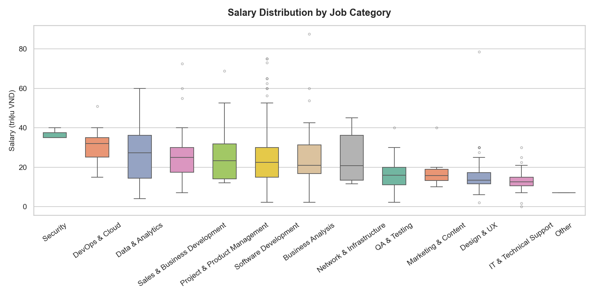
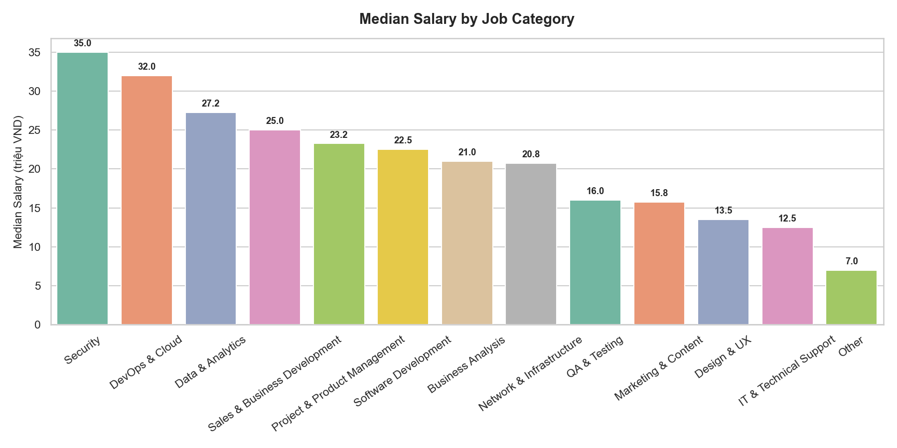
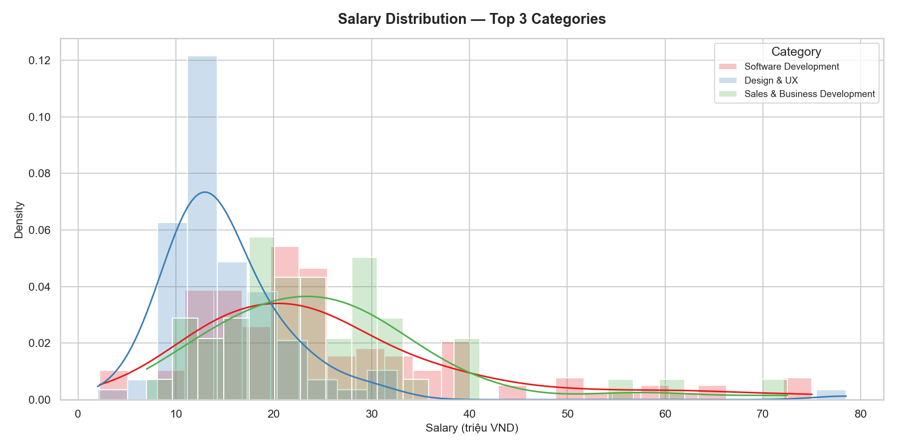
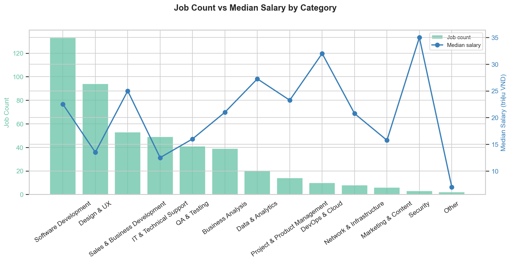
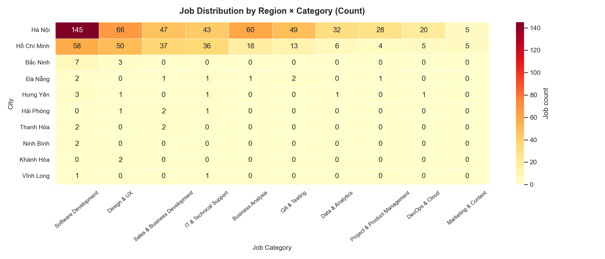
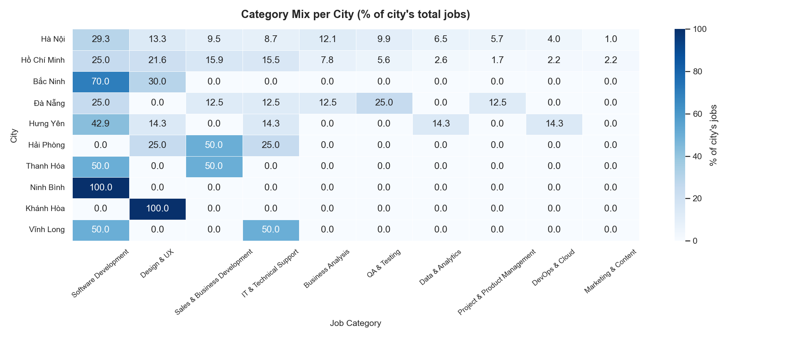
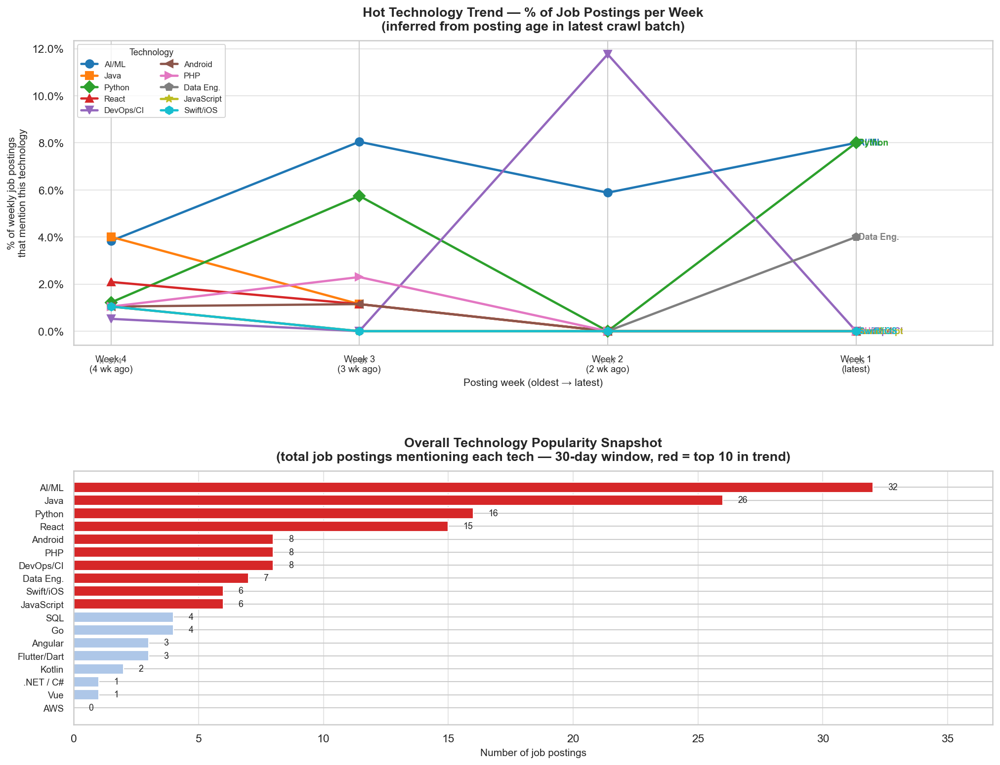
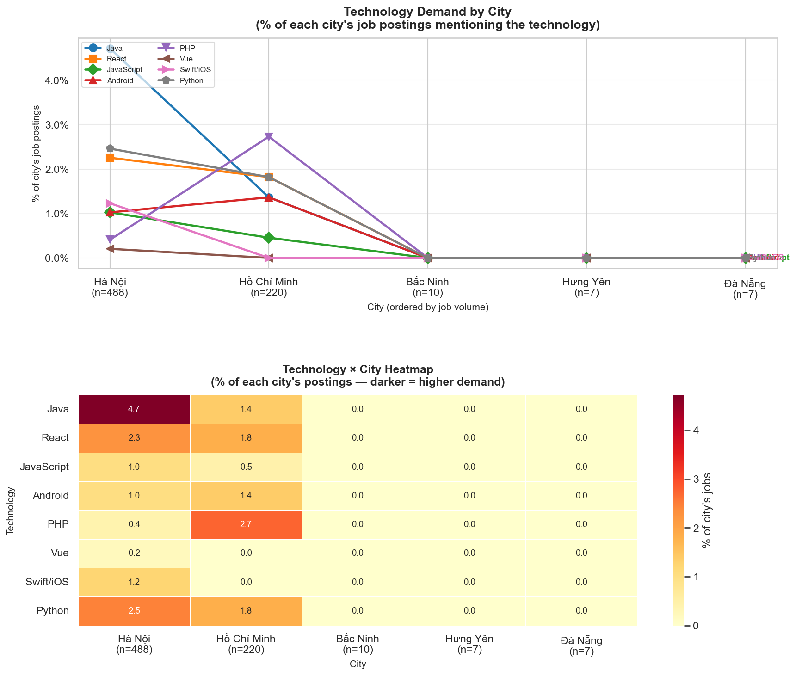

# Basic ETL Pipeline — TopCV → PostgreSQL

A production-quality Python ETL pipeline that crawls Vietnamese IT job postings from [TopCV](https://www.topcv.vn/), cleans and enriches the data, and loads it into PostgreSQL with full deduplication, schema-safe migrations, and automated scheduling via GitHub Actions.

---

## Architecture overview

```
┌─────────────────────────────────────────────────────────┐
│  scripts/crawl_topcv.py          (run every 2 days)     │
│                                                          │
│  1. Query DB → known job links  (hard fail if DB down)   │
│  2. Crawl TopCV pages           (retry + backoff)        │
│  3. Archive previous data.csv   (timestamped copy)       │
│  4. Write new batch → data/raw/data.csv                  │
└──────────────────────────┬──────────────────────────────┘
                           │
┌──────────────────────────▼──────────────────────────────┐
│  main.py   (extract → transform → load)                  │
│                                                          │
│  Extract   read CSV, validate columns                    │
│  Transform salary parse · title classify · address expand│
│  Load      ALTER TABLE for new columns · INSERT (append) │
└─────────────────────────────────────────────────────────┘
```

---

## Requirements & What Was Built

### Requirement 1 — Data Cleaning & Normalization

#### 1.1 Salary normalization → `min_salary`, `max_salary`, `salary_unit`

Raw salary strings come in many formats. `etl/transform/salary.py` handles all of them:

| Raw value | `min_salary` | `max_salary` | `salary_unit` |
|---|---|---|---|
| `10 - 20 triệu` | 10 000 000 | 20 000 000 | VND |
| `Trên 15 triệu` | 15 000 000 | — | VND |
| `Tới 30 triệu` | — | 30 000 000 | VND |
| `$1,500 - $2,000` | 1 500 | 2 000 | USD |
| `Thoả thuận` / `Negotiable` | — | — | — |

#### 1.2 Address parsing → `job_locations` table

Raw addresses follow patterns like `City: District`, `City: D1, D2`, or multi-city `City1 & City2`.  
TopCV UI badges like `(mới)` are stripped; vague entries like `"3 nơi khác"` are discarded.  
`etl/transform/address.py` expands each address into one row per `(city, district)` pair:

```
job_id | sort_order | city        | district
-------|------------|-------------|----------
abc123 | 0          | Hà Nội      | Cầu Giấy
abc123 | 1          | Hà Nội      | Đống Đa
def456 | 0          | Hồ Chí Minh | Quận 7
```

#### 1.3 Job title normalization → `job_role_category`

`etl/transform/job_title.py` uses a **3-stage pipeline** to classify every title into one of 14 categories:

1. **Noise stripping** — removes parentheticals, salary hints, job codes
2. **Rule-based matching** — keyword lookup (ordered by specificity, bilingual EN/VI)
3. **TF-IDF fallback** — char n-gram cosine similarity against seed phrases (handles typos & Vietnamese variants)

| Category | Example titles |
|---|---|
| Software Development | Senior Backend Developer, Lập Trình Viên PHP |
| QA & Testing | Automation Tester, Chuyên Viên Kiểm Thử |
| DevOps & Cloud | DevOps/SRE, Chuyên Viên Vận Hành Cloud |
| Data & Analytics | Data Engineer, AI Engineer, Chuyên Gia Big Data |
| Business Analysis | Business Analyst, BRSE, Kỹ Sư Cầu Nối |
| Project & Product Management | Product Owner, Scrum Master |
| Network & Infrastructure | Network Engineer, DBA |
| IT & Technical Support | Helpdesk, Nhân Viên IT |
| Security | Cybersecurity Analyst, Pentest Engineer |
| Design & UX | UI/UX Designer, Graphic Designer |
| Marketing & Content | SEO Specialist, Content Writer |
| Sales & Business Development | Business Development, Telesales |
| Technical Writing | Technical Writer |
| Other | Anything that does not match |

---

### Requirement 2 — Data Pipeline

#### 2.1 Crawl step — `scripts/crawl_topcv.py`

Runs before the ETL to fetch only **new** job postings:

```
1. get_engine()           → hard fail if DB credentials missing
2. fetch_known_links()    → query records.link_description from DB
                            hard fail if DB unreachable
                            empty set only on first-ever run (table absent)
3. crawl_topcv()          → paginate TopCV, skip known links
                            stop early when an entire page is all-known
                            retry with exponential backoff on 5xx / 429
4. archive_raw_file()     → copy previous data.csv to data/raw/archive/
                            prune oldest archives (default: keep 14)
5. write CSV              → overwrite data/raw/data.csv with new batch only
```

Key flags:

```bash
python scripts/crawl_topcv.py \
  --max-pages 15   \   # pages to crawl (~40 jobs/page)
  --delay 2.0      \   # polite pause between requests (seconds)
  --max-retries 3  \   # HTTP retry attempts per page
  --archive-keep 14    # number of archive snapshots to retain
```

#### 2.2 ETL step — `main.py`

```
data/raw/data.csv
      │
      ▼
[ Extract ]  etl/extract/extract.py
  • Read CSV (UTF-8 with Latin-1 fallback)
  • Validate required columns ("salary")
  • Raise ExtractError on empty file or missing columns
      │
      ▼
[ Transform ]  etl/transform/transform.py
  • _validate_input        — raise early on unusable input
  • step_add_job_id        — MD5(link + company + title + date) → stable PK
  • step_parse_salary      — min_salary, max_salary, salary_unit
  • step_classify_job_title — job_role_category (rule + TF-IDF)
  • step_extract_locations — (city, district) child table
  • write_processed()      — data/processed/salary_cleaned.csv
                             data/processed/job_locations.csv
      │
      ▼
[ Load ]  etl/load/load.py
  • Connection check (fail fast before opening transaction)
  • Single transaction (engine.begin()):
      ALTER TABLE … ADD COLUMN IF NOT EXISTS   ← schema migration, no DROP
      INSERT INTO records        (parent first, satisfies FK)
      INSERT INTO job_locations  (child after)
  • Append-only — existing rows never deleted
  • records.job_id PRIMARY KEY rejects duplicates (last-resort guard)
```

#### 2.3 Error handling

Custom exception hierarchy in `etl/errors.py`:

```
ETLError
├── ExtractError   — file not found, unreadable, empty, missing columns
├── TransformError — empty DataFrame, missing salary column, CSV write failure
├── LoadError      — DB unreachable, write failure (triggers full rollback)
├── ConfigError    — missing environment variables
└── CrawlError     — page fetch failed after all retries exhausted
```

`main.py` catches each type separately, logs a clear message, and exits with a non-zero code so CI/CD detects failures automatically.

#### 2.4 Scheduled execution

| Method | File | Schedule |
|---|---|---|
| **GitHub Actions** | `.github/workflows/etl-scheduled.yml` | Every 2 days at 06:00 UTC + manual trigger |
| **Local cron** | `scripts/run_pipeline.sh` + `scripts/crontab.example` | Configure freely |

The GitHub Actions workflow runs the full crawl → test → ETL sequence. Data files are **not committed to git** — PostgreSQL is the source of truth.

---

### Requirement 3 — Data Analysis

All charts are produced in `notebooks/salary_analysis.ipynb` and saved to `reports/figures/`.  
Re-run all cells to regenerate from the latest data.

---

#### 3.1 Salary Distribution by Job Position

**Approach**

1. Load `data/processed/salary_cleaned.csv`.
2. Drop rows where both `min_salary` and `max_salary` are null (genuinely negotiable / missing).
3. Convert USD → VND at a fixed rate (1 USD = 25,000 VND) so all values are comparable.
4. Scale to **millions of VND** for readability.
5. Compute `mid_salary = (min + max) / 2`; remove extreme outliers (`mid_salary > 200 triệu`).
6. Plot four complementary views.

| Chart 1 — Box plot: spread & outliers per category | Chart 2 — Median salary bar: ranked pay per category |
|:---:|:---:|
|  |  |
| Each box shows the IQR (25th–75th percentile) of mid-salary. DevOps & Cloud and Data & Analytics sit at the top; IT & Technical Support at the bottom. | Sorted horizontal bar with the exact median labelled. Quick salary benchmark per role. |

| Chart 3 — KDE: salary density for the top 3 categories | Chart 4 — Dual-axis: job count vs median salary |
|:---:|:---:|
|  |  |
| KDE overlaid on histogram — shows the full shape of the distribution, not just the median. | Bars = job count (left axis) · Line = median salary (right axis). **Volume ≠ pay** — Software Development leads in headcount, not necessarily in salary. |

---

#### 3.2 Heatmap — Job Distribution by Region

**Approach**

1. Merge `job_locations.csv` with `salary_cleaned.csv` on `job_id`.
2. Filter to the **top 10 cities** by posting count.
3. Filter to the **top 10 categories** by posting count.
4. Build a pivot table: rows = cities, columns = categories, values = job count.
5. Produce two views — raw count and row-normalised percentage.

| Chart 5 — Count heatmap (city × category) | Chart 6 — % mix heatmap (normalised per city) |
|:---:|:---:|
|  |  |
| Raw number of job postings per city–category pair. Hà Nội and Hồ Chí Minh dominate by volume. | Each row sums to 100% — removes volume bias. Reveals what each city's market actually specialises in. |

---

#### 3.3 Trend Chart — In-Demand Technologies (Weekly)

**Approach**

The `time` field records how long ago a job was posted (`"Đăng X ngày trước"`, `"Đăng X tuần trước"`, `"Đăng hôm nay"`).  
This is parsed into `days_ago` and bucketed into 4 weekly cohorts (oldest Week 4 → latest Week 1).

1. Parse `time` → `days_ago` (days / weeks / today formats).
2. Filter to jobs posted within the last 30 days.
3. Match 18 technology keyword patterns (regex) against lowercased `job_title`.
4. Compute each technology's **% share of that week's postings**.
5. Plot trend lines (top 10 techs) + bar chart (all techs).

**Chart 7 — Technology trend (weekly % lines + snapshot bar)**



---

#### 3.4 Technology Demand by City

**Approach**

Uses actual `job_locations.csv` — a genuine geographic dimension requiring no inference.

1. Merge `job_locations` with `salary_cleaned` on `job_id`; keep primary location only (`sort_order = 0`).
2. Detect technologies by matching 8 regex patterns against lowercased `job_title`.
3. For each city compute: `% of that city's jobs mentioning the technology`.
4. Filter to cities with **≥ 5 jobs** (smaller samples produce unreliable percentages).
5. Plot as lines (geographic shift) and heatmap (full matrix).

**Chart 8 — Tech demand by city (line chart + heatmap)**



---

## Project Layout

```
basic-etl-pipeline/
├── config/
│   ├── schema.sql              # PostgreSQL DDL (PK, FK, indexes)
│   └── settings.py             # Loads .env, get_engine(), directory constants
├── data/
│   ├── raw/
│   │   ├── data.csv            # Latest crawl batch (gitignored)
│   │   └── archive/            # Timestamped previous batches (gitignored)
│   └── processed/              # salary_cleaned.csv, job_locations.csv (gitignored)
├── etl/
│   ├── errors.py               # ETLError · ExtractError · TransformError
│   │                           # LoadError · ConfigError · CrawlError
│   ├── extract/extract.py      # CSV → DataFrame
│   ├── transform/
│   │   ├── salary.py           # Salary string → (min, max, unit)
│   │   ├── address.py          # Address string → [(city, district), …]
│   │   ├── job_title.py        # Title → category (rules + TF-IDF)
│   │   └── transform.py        # Orchestrates all transform steps
│   └── load/load.py            # ALTER TABLE + INSERT (append-only)
├── notebooks/
│   └── salary_analysis.ipynb  # All 8 analysis charts
├── reports/figures/            # PNG outputs from the notebook
├── scripts/
│   ├── crawl_topcv.py          # Crawl orchestrator (DB dedup + archive + ETL trigger)
│   ├── run_pipeline.sh         # Shell wrapper for local cron
│   └── crontab.example         # Example cron entry
├── tests/
│   ├── test_salary.py          # 17 cases — VND/USD range/bound/exact/negotiable
│   ├── test_address.py         # 27 cases — colon blocks, & separator, (mới), nơi khác
│   └── test_job_title.py       # 44 cases — all 14 categories + edge cases
├── .github/workflows/
│   └── etl-scheduled.yml       # Crawl → test → ETL every 2 days at 06:00 UTC
├── .env.example                # Template — copy to .env and fill in
├── docker-compose.yml          # PostgreSQL 16 + pgAdmin (local dev)
├── main.py                     # ETL CLI entrypoint
└── requirements.txt            # Pinned dependencies
```

---

## Quick Start

### 1. Prerequisites

- Python 3.11+
- PostgreSQL — local via [Docker](https://docs.docker.com/get-docker/) **or** a cloud instance (Supabase, Railway, Neon)

### 2. Install

```bash
git clone <repo-url>
cd basic-etl-pipeline

python3 -m venv .venv
source .venv/bin/activate      # Windows: .venv\Scripts\activate
pip install -r requirements.txt
```

### 3. Configure

```bash
cp .env.example .env
# Edit .env — fill in DB_HOST, DB_PORT, DB_NAME, DB_USER, DB_PASSWORD
```

### 4. Start the database (local Docker only)

```bash
docker compose up -d
# Schema (tables, FK, indexes) applied automatically on first volume creation
```

Skip this step if using a cloud PostgreSQL instance — just point `.env` at it.

### 5. Run the full pipeline

```bash
# Step 1 — crawl new jobs from TopCV
python scripts/crawl_topcv.py --max-pages 15

# Step 2 — transform and load into PostgreSQL
python main.py data/raw/data.csv
```

Or as a one-liner:

```bash
python scripts/crawl_topcv.py --max-pages 15 && python main.py data/raw/data.csv
```

For a quick local test (3 pages, verbose logging):

```bash
python scripts/crawl_topcv.py --max-pages 3 -v && python main.py data/raw/data.csv
```

Expected output:

```
2026-03-30 12:00:00 INFO scripts.crawl_topcv: Fetched 509 known links from database.
2026-03-30 12:00:01 INFO etl.extract.topcv_crawl: Crawling page 1/15 — https://...
...
2026-03-30 12:01:00 INFO scripts.crawl_topcv: Wrote 750 rows to data/raw/data.csv (overwrite)
2026-03-30 12:01:01 INFO etl.extract.extract: Extracted 750 rows from data/raw/data.csv
2026-03-30 12:01:02 INFO etl.transform.transform: Salary parse — rows: 750 | parsed: 472 (63%)
2026-03-30 12:01:03 INFO etl.load.load: Inserted 750 rows into 'records'
2026-03-30 12:01:03 INFO etl.load.load: Inserted 792 rows into 'job_locations'
```

### 6. Run unit tests

```bash
python -m pytest tests/ -v
# 84 passed in ~1s
```

### 7. Open the analysis notebook

```bash
jupyter notebook notebooks/salary_analysis.ipynb
# Run all cells to regenerate all 8 charts
```

Or regenerate headlessly:

```bash
jupyter nbconvert --to notebook --execute notebooks/salary_analysis.ipynb --inplace
```

---

## Inspecting the database

**pgAdmin (Docker only):** [http://localhost:8080](http://localhost:8080) — sign in with `PGADMIN_EMAIL` / `PGADMIN_PASSWORD` from `.env`.

**psql:**

```bash
# Docker
docker compose exec postgres psql -U "$DB_USER" -d "$DB_NAME"

# Cloud / local install
psql "postgresql://$DB_USER:$DB_PASSWORD@$DB_HOST:$DB_PORT/$DB_NAME"
```

Useful queries:

```sql
-- Jobs with all their locations
SELECT r.job_title, r.job_role_category, l.city, l.district
FROM records r
LEFT JOIN job_locations l ON r.job_id = l.job_id
LIMIT 20;

-- Salary stats per category (VND only)
SELECT job_role_category,
       COUNT(*)                              AS jobs,
       ROUND(AVG(min_salary) / 1e6, 1)      AS avg_min_m,
       ROUND(AVG(max_salary) / 1e6, 1)      AS avg_max_m
FROM records
WHERE salary_unit = 'VND'
GROUP BY job_role_category
ORDER BY avg_max_m DESC NULLS LAST;

-- Top hiring cities
SELECT city, COUNT(*) AS postings
FROM job_locations
GROUP BY city
ORDER BY postings DESC
LIMIT 10;

-- Total unique jobs loaded
SELECT COUNT(*) FROM records;
```

---

## Scheduled runs (GitHub Actions)

1. Go to **Settings → Secrets → Actions** in the repository.
2. Add five secrets: `DB_HOST`, `DB_PORT`, `DB_NAME`, `DB_USER`, `DB_PASSWORD`.  
   The host must be publicly reachable — `localhost` will not work from GitHub runners.  
   Use [Supabase](https://supabase.com), [Railway](https://railway.app), or [Neon](https://neon.tech) for a free cloud PostgreSQL.
3. The workflow (`.github/workflows/etl-scheduled.yml`) runs automatically every 2 days at 06:00 UTC and can be triggered manually via **Actions → Run workflow**.

Run sequence on each trigger:

```
Crawl   → query DB for known links → fetch new jobs → archive + write CSV
Tests   → pytest tests/
ETL     → extract → transform → load into PostgreSQL (append-only)
```

Data files are never committed to git — the database accumulates all history.

---

## Troubleshooting

| Symptom | Fix |
|---|---|
| `RuntimeError: Cannot fetch known links from database` | DB is unreachable. Check `.env` credentials and that the database is running before crawling. |
| `ConfigError: Missing required environment variable` | Copy `.env.example` to `.env` and fill in all five DB variables. |
| `No module named 'config'` | Run `python main.py` from the project root, not from inside a subdirectory. |
| `Connection refused` | `docker compose ps` — Postgres must be running; use `DB_HOST=localhost` when running on the host machine. |
| `Password authentication failed` | Check `.env` matches the credentials Docker used on first volume creation. If they changed, run `docker compose down -v` and restart. |
| Salary parse rate seems low | Expected — ~37% of salaries are genuinely `"Thoả thuận"` (negotiable) or blank. |
| Charts look outdated | Re-run the notebook: `jupyter nbconvert --to notebook --execute notebooks/salary_analysis.ipynb --inplace` |
